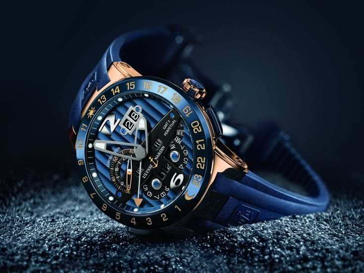

# Bienvenido a la API de Relojes de Lujo 🎩⌚



La API de Relojes de Lujo proporciona acceso a información detallada sobre los relojes más exclusivos del mundo, incluyendo:

<div class="grid cards" markdown>
- __🌐 5,000+ modelos__  
  Desde Patek Philippe hasta Richard Mille
- __📈 Datos en tiempo real__  
  Precios, disponibilidad y subastas
- __🔐 Autenticación segura__  
  API Key y OAuth 2.0
- __⚡ Ejemplos listos__  
  En múltiples lenguajes
</div>

## Quick Start 🚀

Empieza en 30 segundos con nuestro SDK oficial:

=== "JavaScript"
    ```javascript
    const RelojesApi = require('relojes-lujo-api');
    const client = new RelojesApi('tu_api_key');
    client.getColeccion('Patek Philippe')
      .then(response => console.log(response))
      .catch(error => console.error('Error:', error));
    ```

## Modelos Destacados

| Modelo               | Marca            | Precio (USD) | Disponibilidad |
|----------------------|------------------|-------------:|---------------:|
| Nautilus 5711/1A-010 | Patek Philippe   | $120,000     | 🔴 Agotado     |
| Daytona 116500LN     | Rolex            | $48,000      | 🟡 Lista espera|
| Royal Oak 15500ST    | Audemars Piguet  | $65,000      | 🟢 Disponible  |

## Características Clave

1. **Datos Técnicos Complejos**  
   - Movimientos mecánicos
   - Certificaciones COSC
   - Materiales exclusivos
   - Main

2. **Integración Simple**  
   ```http
   GET /v1/modelos/5711-1A-010 HTTP/1.1
   Host: api.relojesdelujo.com
   X-API-KEY: tu_api_key
```